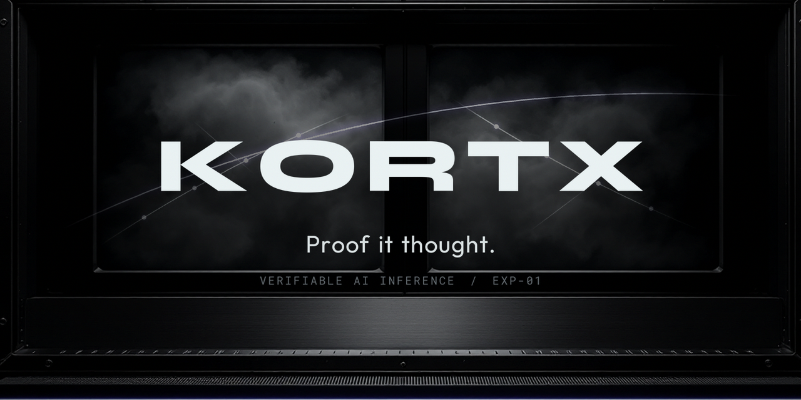
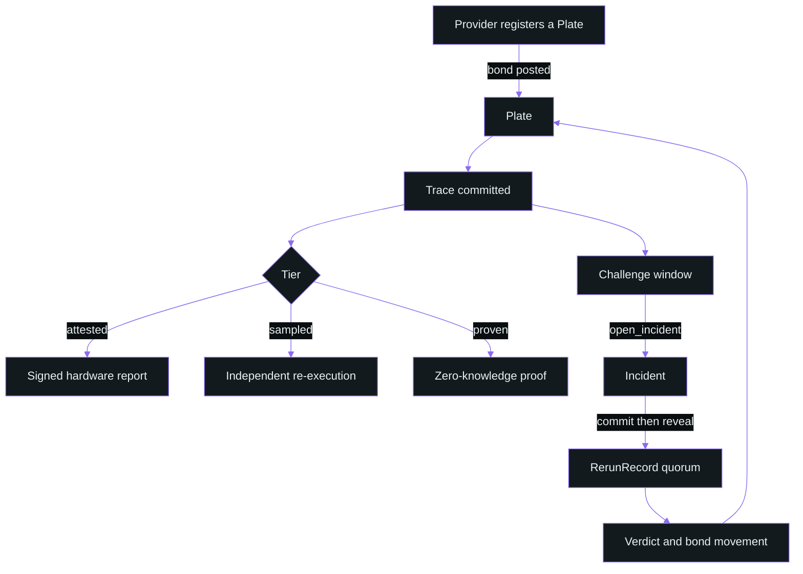

<p align="center">
  
</p>

<p align="center">
  <a href="https://kortx.fi"></a>
  <a href="https://x.com/kortxfi"></a>
  <a href="https://github.com/kortx-labs"></a>
  <a href="https://github.com/kortx-labs/kortx-base/actions/workflows/ci.yml"></a>
  <a href="https://github.com/kortx-labs/kortx-base/blob/main/LICENSE"></a>
  <a href="https://github.com/kortx-labs/kortx-base/commits/main"></a>
  <a href="https://explorer.solana.com/address/Eag1WgBbZay94E6Z9dLfUcgGUiDZRLD8Qc9qNNK6a7NS?cluster=devnet"></a>
  <a href="https://www.anchor-lang.com"></a>
  <a href="https://github.com/kortx-labs/kortx-base/blob/main/docs/not-proven.md"></a>
  <a href="https://github.com/kortx-labs/kortx-solana"></a>
  <a href="https://github.com/kortx-labs/kortx-sdk"></a>
</p>

# kortx-base

The protocol record for KORTX: what a trace fixes, what each evidence tier covers, and where the
coverage stops.

**Proof it thought.**

An inference leaves nothing behind. KORTX makes it leave a trace: the input hash, the output hash,
the model fingerprint, and the seed, committed on Solana by a bonded provider, with the class of
evidence that backs it printed on the same record.

In a cloud chamber you never see the particle. You see the line of condensation it left behind, and
that line is enough to say what went through. This project is built on the same move.

## Start here

| Document | What it answers |
|---|---|
| [docs/not-proven.md](docs/not-proven.md) | **Read this first.** What KORTX does not prove, with the measurement behind each limit |
| [docs/architecture.md](docs/architecture.md) | Which components exist, how a trace flows, where the boundaries are |
| [docs/trace-record.md](docs/trace-record.md) | The on-chain accounts and the two mechanisms that carry the design |
| [docs/tiers.md](docs/tiers.md) | Each tier as a guarantee and non-guarantee pair, with costs |
| [docs/sampling.md](docs/sampling.md) | The detection probability table, and why byte equality is the wrong comparison |

## Deployment

| Field | Value |
|---|---|
| Program ID | `Eag1WgBbZay94E6Z9dLfUcgGUiDZRLD8Qc9qNNK6a7NS` |
| Cluster | `devnet` |
| Explorer | [explorer.solana.com/address/Eag1WgBbZay94E6Z9dLfUcgGUiDZRLD8Qc9qNNK6a7NS?cluster=devnet](https://explorer.solana.com/address/Eag1WgBbZay94E6Z9dLfUcgGUiDZRLD8Qc9qNNK6a7NS?cluster=devnet) |
| Anchor | 0.31.1 |
| Interface | 15 instructions, 6 accounts, 18 events, 68 error variants |

The program is on `devnet`. It is not on mainnet.

## The system in one diagram



## What KORTX proves

A trace record fixes four things that cannot be revised after the fact.

- **The commitment.** An input hash, an output hash, a model fingerprint, and a seed, written to
  Solana by an account that has posted a bond, at a known slot. The record is public and it is not
  editable by the party that wrote it.
- **The class of evidence.** Every trace carries one of three tiers, and each tier states its own
  coverage on the record itself. A trace never inherits the strength of a tier it did not use.
- **The challenge history.** Whether an independent party opened an incident, what their
  re-execution produced, and how the dispute resolved. Bonds move on that outcome.
- **The provider's record over time.** Traces committed, incidents opened, mismatches found, bond
  remaining. Cumulative and adversarial, which is what makes it hard to fake.

## What KORTX does NOT prove

This section is not a footnote. It is the reason the rest of the protocol is shaped the way it is.

- **KORTX does not prove that a model is good.** It checks whether a computation can be reproduced
  or certified. A reproducible model can still be wrong, biased, or unsafe. Reproducibility is a
  property of the execution, not of the answer.
- **KORTX does not prove that the declared weights are the weights that ran, except where the tier
  says so.** Hardware attestation measures the driver and the VBIOS. It does not measure model
  weights.
- **KORTX does not prove that a prover spent computation matching the advertised model size.** A
  zero-knowledge proof certifies that an equation holds. It does not certify an amount of work.
  Published research demonstrates a model that presents itself as twelve layers while computing
  six, at no additional serving cost.
- **KORTX does not prove anything about an inference that was not sampled.** The sampled tier gives
  a probability, and the sampling rate that produced it is printed on the record.
- **KORTX does not carry a zero-knowledge proof of a full large language model forward pass.** No
  system does today. The published ceiling for full-inference proofs is 13B parameters, at 803
  seconds on one A100 for a single 2,048-token sequence, producing a 188 kB artifact. A Solana
  transaction holds 1,232 bytes.
- **KORTX does not survive a compromise of the hardware vendor's root of trust at the attested
  tier.** Trust at that tier reduces to the silicon vendor and the vendor's attestation service.
- **KORTX does not detect a provider who is honest on sampled traces and dishonest elsewhere,
  beyond the probability the sampling rate gives.** That probability is stated, not implied.

The long form, with each figure attributed, is in [docs/not-proven.md](docs/not-proven.md).

## The three tiers, in pairs

| Tier | Guarantees | Does not guarantee |
|---|---|---|
| `attested` | A signed hardware report, bound to this trace, states that a measured GPU driver and VBIOS ran inside a confidential virtual machine on genuine silicon | That the weights in that machine match the plate, or that the report came from the machine that served this request |
| `sampled` | This trace was drawn for independent re-execution under a pinned environment, and an independent node reproduced the output byte for byte | Anything about traces that were not drawn. At a 5 percent sampling rate a provider who cheats once is caught with probability 0.05 |
| `proven` | A zero-knowledge proof certifies that the declared circuit, evaluated on the committed input, yields the committed output, with no trust in the provider | Coverage of transformer language models. The tier rejects model classes it does not support rather than degrading quietly |

Full cards, with costs and trust assumptions, are in [docs/tiers.md](docs/tiers.md).

## Numbers this project publishes

Each of these is a measurement, with the condition that produced it. Sources are given in
[docs/not-proven.md](docs/not-proven.md).

```text
At temperature 0, the same prompt run 1,000 times produced 80 distinct outputs.
The first 102 tokens were identical every time; divergence began at token 103.

With the execution environment pinned, 10,000 runs produced identical hashes
and zero bit-level drift.

An A100 and an H100 running the same weights on the same input agree
0.0 percent of the time at the bit level.

Making inference deterministic costs between 1.8 percent and 133 percent,
depending on the serving stack.

Proof artifacts run from 188 kB to 22.85 MB.
A Solana transaction holds 1,232 bytes.

Committing one trace on Solana costs 0.0032762 SOL: 3,271,200 lamports of rent
exemption for a 342-byte account plus a 5,000-lamport signature fee.
```

## Checking these documents

The consistency rules are enforced, not trusted:

```bash
git clone https://github.com/kortx-labs/kortx-base.git
cd kortx-base
node tools/check-docs.mjs
```

It fails the build when the program id or cluster drifts between documents, when a verification
claim appears without naming its tier, when a phrase this project has ruled out reappears, or when
an emoji creeps in. CI runs the same command on every push.

## Repositories

| Repository | What it is |
|---|---|
| [kortx-solana](https://github.com/kortx-labs/kortx-solana) | The Anchor program and its published IDL |
| [kortx-sdk](https://github.com/kortx-labs/kortx-sdk) | `@kortx/sdk` and the `kortx` command line client |
| kortx-base | This repository |

## Contributing

Read [CONTRIBUTING.md](CONTRIBUTING.md). The rule that matters: every number carries its condition,
and a limitation is never softened to make a section read better.

## License

MIT. See [LICENSE](LICENSE).
