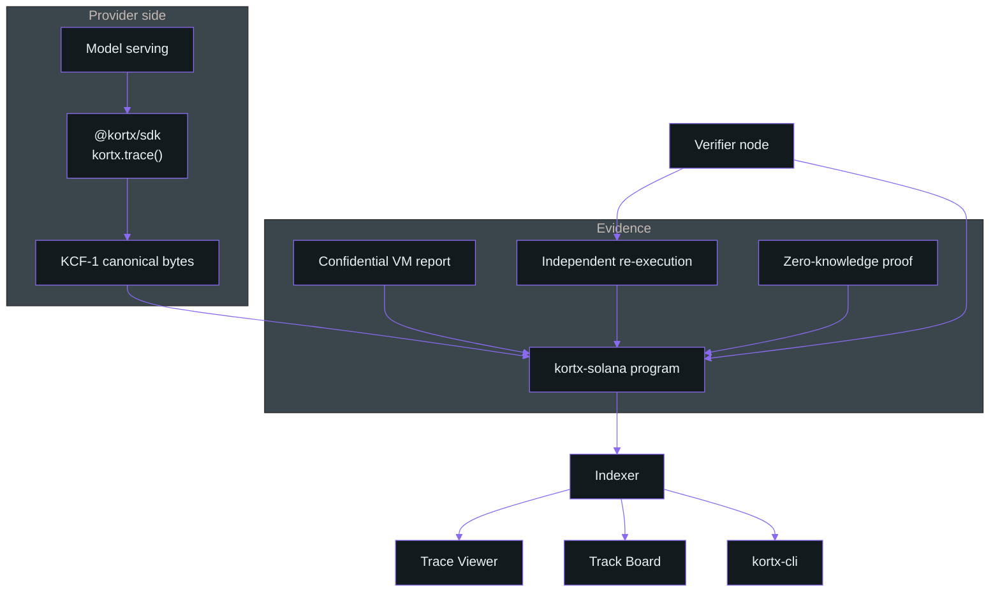

# Architecture

KORTX is a verification layer for inference results. It records what was computed and how strongly
that record is backed. It does not broker, price, or resell computation.

This page is the map: which pieces exist, which repository each lives in, and where the boundaries
are drawn.

---

## Components

| Component | Repository | What it does |
|---|---|---|
| Anchor program | [kortx-solana](https://github.com/kortx-labs/kortx-solana) | Holds the record. Plates, traces, incidents, bonds, quorum resolution |
| TypeScript SDK | [kortx-sdk](https://github.com/kortx-labs/kortx-sdk) | Issues receipts, canonicalizes payloads, reads the indexer, submits on chain |
| Command line client | [kortx-sdk](https://github.com/kortx-labs/kortx-sdk) | The `kortx` binary, built so a shell script can tell four failure modes apart |
| Protocol documentation | kortx-base | This repository |

---

## Deployment

| Field | Value |
|---|---|
| Program ID | `Eag1WgBbZay94E6Z9dLfUcgGUiDZRLD8Qc9qNNK6a7NS` |
| Cluster | `devnet` |
| Explorer | [explorer.solana.com/address/Eag1WgBbZay94E6Z9dLfUcgGUiDZRLD8Qc9qNNK6a7NS?cluster=devnet](https://explorer.solana.com/address/Eag1WgBbZay94E6Z9dLfUcgGUiDZRLD8Qc9qNNK6a7NS?cluster=devnet) |
| Anchor | 0.31.1 |
| Interface | 15 instructions, 6 accounts, 18 events, 68 error variants |

The program is on `devnet`. It is not on mainnet.

---

## The flow

1. **Register.** A provider posts a bond and registers a `Plate`: the model id, the weights hash,
   a model fingerprint, and a `DeterminismPolicy`. The bond is what a slash takes from.

2. **Commit.** For each inference the provider writes a `Trace`: input hash, output hash, model
   fingerprint, seed, and the tier it is claiming. The hashes are computed locally by the SDK. No
   network round trip is required to produce a receipt, which is why `trace()` is synchronous in
   the part that matters.

3. **Back the claim.** One of `attest_trace`, `submit_sample_result`, or `submit_proof` attaches the
   evidence for the declared tier. The instruction checks the evidence against the tier; a trace
   cannot present evidence belonging to a tier it did not claim.

4. **Challenge.** Any bonded party can `open_incident` against a trace before its
   `challenge_deadline`. Opening an incident costs a bond, which is what keeps it from being free.

5. **Re-run.** Verifiers commit `hash(output_hash, salt, verifier, subject)`, then reveal. The
   protocol compares the reveals within a `divergence_bps` tolerance and resolves by quorum.

6. **Settle.** `resolve_incident` moves bonds according to the basis-point split in `Config`. The
   trace's status becomes final and the plate's cumulative statistics update.

The record that results is public and cumulative. A provider's history is the part of this system
that is hardest to fake, because it accrues under adversarial conditions rather than being
asserted.

---

## Where the boundaries are

**KORTX is not a compute market.** It records what was computed and how strongly that record is
backed. It does not broker, price, or resell computation, and nothing in the protocol has a notion
of a price for a GPU hour.

**KORTX is not a general proving system.** It verifies AI inference results specifically. The
proven tier accepts a listed set of model classes and rejects the rest.

**KORTX is not an identity system.** It checks the output of a model, not who or what a model is.
There is no account type here that answers "is this agent who it says it is".

The evidence classes KORTX uses are not novel. Hardware attestation, optimistic re-execution, and
zero-knowledge proofs each have production deployments elsewhere. What KORTX fixes is that a
consumer of an AI output usually cannot tell which one, if any, stands behind it.

Tiered verification is not a KORTX invention either. Other projects offer a choice of verification
strength. The narrower position here is that the tier travels with the output, on chain, as part of
the record rather than as a claim in a dashboard.

---

## Design decisions worth arguing with

### The tier is on the record, not on the dashboard

A verification claim without its tier is unfalsifiable. Putting the tier in the account means the
badge, the API response, and the explorer all read the same field, and a weak tier cannot be
rendered as a strong one downstream.

### Commit-reveal on every re-run

A verifier can read the committed output hash off the chain. Without a commitment step the cheapest
strategy is to echo it back. See [trace-record.md](trace-record.md#commit-reveal-on-re-runs).

### A divergence tolerance rather than byte equality

An A100 and an H100 running the same weights on the same input agree 0.0 percent of the time at the
bit level. Byte equality across a heterogeneous verifier set slashes honest providers at a rate near
100 percent. See [sampling.md](sampling.md#why-byte-equality-is-not-the-comparison).

### Verification and lookup are free

Reading a trace, checking a badge, and browsing the public board require no token and no account.
The protocol's economic surface is bonds and slashing, not access to the record. A verification
layer that charged for lookups would be asking to be trusted about the thing it exists to remove
trust from.

---

## Limits

Read [not-proven.md](not-proven.md) before relying on any of this. It is not an appendix; it is the
part of the design that determines what the rest is worth.
